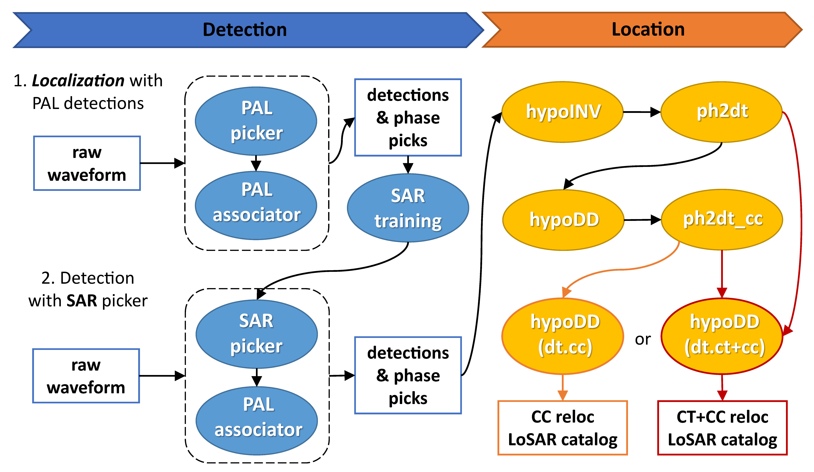

# LoSAR
Construction of Long-Term Seismic Catalog with Deep Learning: A Workflow for Localized Self-Attention RNN (LoSAR)  


## Usage  
### 1. Train SAR model  
**1.1 run [PAL](https://github.com/YijianZhou/PAL) to generate local training samples**  
**1.2 cut event windows & generate [Zarr](https://zarr.readthedocs.io/en/stable/) database**  
```bash
python 1_cut_train-samples.py
python 2_sac2zarr.py
```  
**1.3 train SAR model**  
```bash
python 3_train.py
```
### 2. Apply LoSAR on continuous data & associate picks  
**2.1 run LoSAR**  
```bash
python 4_pick_stream.py
```  
**2.2 associate picks with PAL associator**  
```bash
python 5_parallel_assoc.py
```  


### Reference  
- **Zhou, Y.**, H. Yue, Q. Kong, & S. Zhou (2019). Hybrid Event Detection and Phase‐Picking Algorithm Using Convolutional and Recurrent Neural Networks. *Seismological Research Letters*; 90 (3): 1079–1087. doi: [10.1785/0220180319](https://doi.org/10.1785/0220180319)  
- **Zhou, Y.**, H. Yue, L. Fang, S. Zhou, L. Zhao, & A. Ghosh (2021). An Earthquake Detection and Location Architecture for Continuous Seismograms: Phase Picking, Association, Location, and Matched Filter (PALM). *Seismological Research Letters*; 93(1): 413–425. doi: [10.1785/0220210111](https://doi.org/10.1785/0220210111)  
- **Zhou, Y.**, A. Ghosh, L. Fang, H. Yue, S. Zhou, & Y. Su (2021). A High-Resolution Seismic Catalog for the 2021 MS6.4/Mw6.1 YangBi Earthquake Sequence, Yunnan, China: Application of AI picker and Matched Filter. *Earthquake Science*; 34(5): 390-398.doi: [10.29382/eqs-2021-0031](https://doi.org/10.29382/eqs-2021-0031)  
